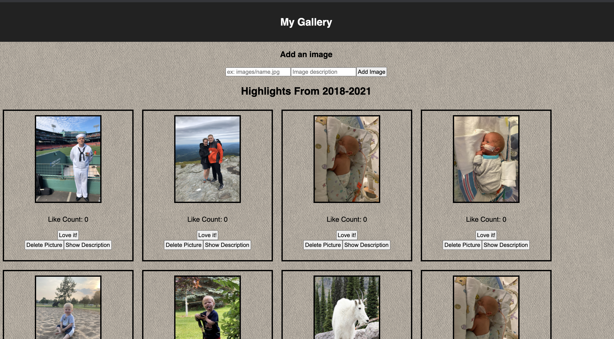

# Weekend React Gallery

## Description

_Duration: 3 Day Sprint_
 
 A small image gallery that shows a few pictures of me and important moments in my recent life.

 ## Screenshot

 

## Checklist

See: https://github.com/hesscm/weekend-react-gallery/wiki/Checklist

### Prerequisites

- Any IDE such as VS Code or a web browser, and npm installed.

## Installation
1. Fork the repository
2. Ensure that [git is installed](https://git-scm.com/downloads) on your Mac/PC.
2. Copy the SSH link under 'Code'.
3. Enter terminal(Mac) or Git Bash(Windows) and in your desired folder, type 'git clone git@github.com:hesscm/weekend-react-gallery.git'.
4. Open with your preferred IDE.
5. You will need node.js installed. In the repo folder, type "npm install" to install all of the included dependencies.
6. Type "npm start" to get the server running.
7. Run the app in the browser at "localhost:5000".

## Usage

1. Browse through the images. Click the 'description' button to learn a little more about the image.
2. Click the 'like' button to add a like to the picture and show your support!
3. You may also delete a picture.
4. You can add an image to the public/images and put the absolute path and description to add it to the database.

## Built With

HTML, CSS, JavaScript, React, node.js(with express, axios, and pg)

## Acknowledgement
Thanks to [Prime Digital Academy](www.primeacademy.io) who equipped and helped me to make this application a reality. (Shout out to Chris Black!)

## Support
If you have suggestions or issues, please email me at [chrishessmusic@gmail.com]